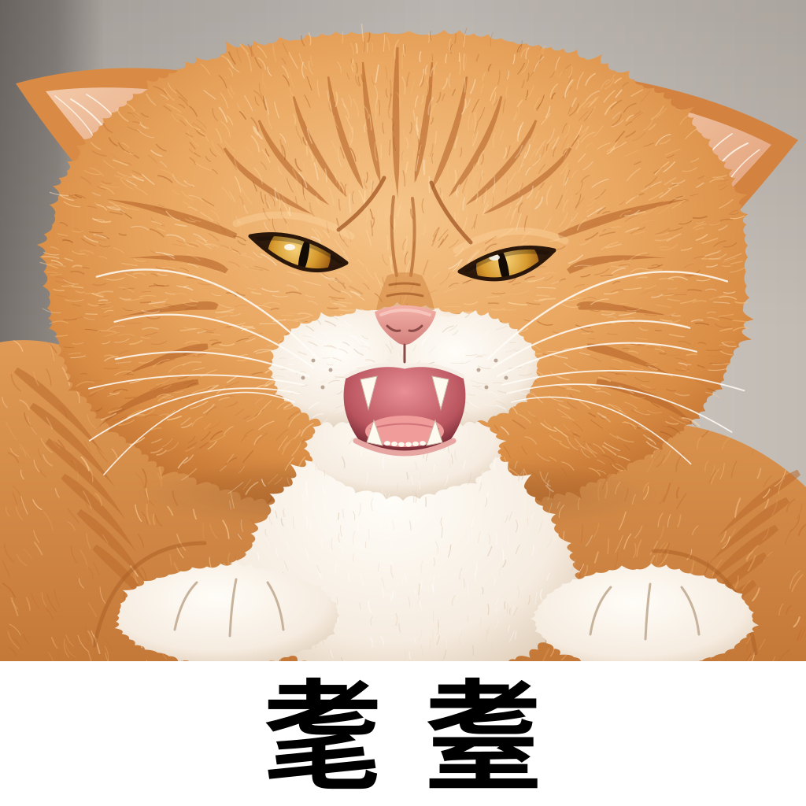

# 耄耋 orange cat

Hand-built vector (SVG) remake of the original generated photo meme, which used to be a 1254×1254 PNG.

Meme reference: [圆头耄耋](https://gengtu.net/memes/mao-die-original-orange-cat/).

## Details

- 1024×1024 `viewBox`, so it scales to any size without losing sharpness
- Very round, broad orange tabby head with flattened airplane ears and forehead "M" stripes
- Furrowed brow, narrowed amber eyes with slit pupils, wrinkled pink nose
- Mouth open in a hiss with fangs, tongue and tiny incisors
- White muzzle, chest and front paws; fur texture comes from layered strokes and gradients
- The “耄耋” caption is stored as outlined paths (Noto Sans CJK SC Bold), so it looks the same whether or not CJK fonts are installed
